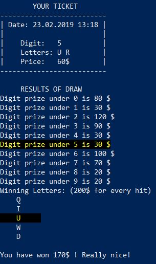
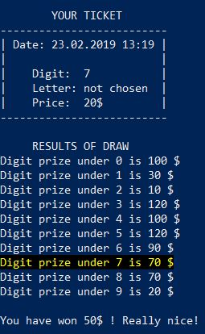

# Pass-LotteryTicket
You can launch a script by typing: <br>
```powershell
. .\Pass-LotteryTicket.ps1 
Pass-LotteryTicket [digit] [choose]
```
in directory which contains this file. <br>
When parameter `choose` equals <b>yes</b>, you should provide values for 2 dynamic parameters eg. <br>
```powershell
Pass-LotteryTicket 5 yes
First_capital_letter: U
Second_capital_letter: R
```

Otherwise, lottery draws digits only and the highest possible prize will be less.

```
Pass-LotteryTicket 7 no
```


